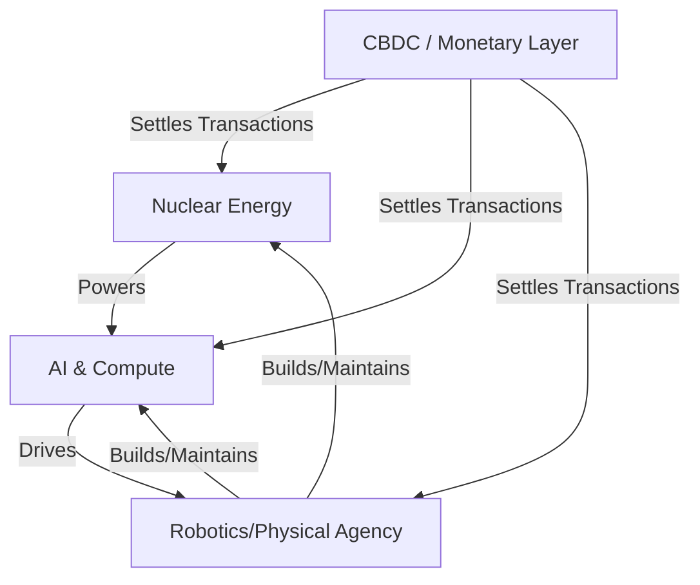

# Sovereign Infrastructure Convergence (2026)

## Overview

The concept of **Sovereign Infrastructure Convergence** refers to the strategic integration of three critical technological and physical pillars: **Central Bank Digital Currencies (CBDCs)**, **Advanced Nuclear Energy**, and **Autonomous Robotics**. 

In the geopolitical landscape of 2026, sovereignty is no longer defined solely by borders and military might, but by the ability of a nation to control its own "Sovereign Stack"—the integrated loop of monetary value, energy provision, and physical agency.

---

## The Three Pillars of Convergence

### 1. Monetary Sovereignty: Central Bank Digital Currencies (CBDC)
As the global economy digitizes, the control of the "unit of account" has become a primary battlefield for national sovereignty.

* **Defensive Utility:** CBDCs are designed to protect domestic monetary systems from the encroachment of foreign-issued stablecoins and decentralized digital assets.
* **Infrastructure Integration:** Unlike speculative crypto-assets, CBDCs are being implemented as core public infrastructure, integrated directly into national payment systems.
* **Efficiency and Programmability:** Modern CBDC architectures allow for real-time settlement, enhanced regulatory compliance (through cryptographic issuance), and the ability to program economic stimulus or tax collection directly into the currency layer.
* **Strategic Control:** By maintaining a digital direct liability of the central bank, nations ensure that the monetary base remains under sovereign jurisdiction, even in a highly networked, digital-first global environment.

### 2. Energy Sovereignty: Advanced Nuclear and the AI Power Nexus
The rapid expansion of Artificial Intelligence (AI) and hyperscale cloud computing has created an unprecedented demand for high-density, reliable, and carbon-neutral power.

* **The AI-Nuclear Link:** The massive computational requirements of Large Language Models (LLMs) and high-performance computing (HPC) are outstripping the capacity of conventional electrical grids.
* **Next-Generation Nuclear:** The convergence is driven by the deployment of Generation IV technologies, such as **Integral Molten Salt Reactors (MSRs)**. These reactors are being designed to sit alongside data centers, providing localized, stable, and massive power supplies.
* **Infrastructure Resilience:** Decentralized, small modular reactors (SMRs) and advanced nuclear technologies reduce reliance on fragile, centralized grids and foreign energy imports, turning energy production into a cornerstone of national security.

### 3. Physical/Agency Sovereignty: Robotics and the AI-Physical Interface
If AI is the "brain" of the new economy, robotics is its "body." The convergence of AI intelligence with advanced robotics allows for the automation of the physical world.

* **Bridging Digital and Physical:** Robotics represents the mechanism through which digital intelligence translates into physical labor, manufacturing, and infrastructure maintenance.
* **Automated Infrastructure:** Autonomous systems are being deployed to build and maintain the very infrastructure required for the other pillars—such as constructing nuclear facilities and operating massive data centers.
* **Workforce and Manufacturing:** The integration of robotics into the domestic supply chain reduces reliance on foreign labor and increases the speed and precision of advanced manufacturing, a critical component of modern economic power.

---

## Synthesis: The Sovereign Stack

The true power of these technologies lies not in their individual capabilities, but in their **convergence**. They form a self-reinforcing, closed-loop system:

1.  **Nuclear Energy** $\rightarrow$ Powers the **AI/Compute** (Data Centers).
2.  **AI/Compute** $\rightarrow$ Drives the intelligence of **Robotics**.
3.  **Robotics** $\rightarrow$ Builds and maintains the **Nuclear** and **Data Center** infrastructure.
4.  **CBDC** $\rightarrow$ Provides the secure, sovereign **Monetary Layer** to facilitate the high-speed, automated transactions within this loop.

### The Feedback Loop Diagram (Conceptual)

## Strategic Implications

Nations that successfully master this convergence—the "Sovereign Stack"—will achieve several key advantages:

* **Resilience to External Shocks:** By controlling their own energy, money, and physical labor, they are insulated from global supply chain disruptions and monetary volatility.
* **Accelerated Economic Cycles:** The automation of the energy-compute-labor loop allows for exponential growth in productivity and infrastructure deployment.
* **Geopolitical Autonomy:** A self-sufficient stack provides the hard power and economic stability necessary to project influence and maintain autonomy in a multipolar world.

---
*Last Updated: June 2026*
*Classification: Strategic Intelligence Research*
